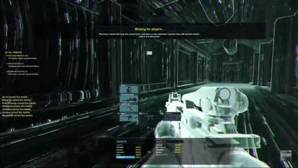

# gdd-project
# Design document

---

# Cyberpunk game

  
---

## Game inspiration

### Books

### Movies

## Anime

  

---
  
  
## Game look and feel

Concepts compatible with AR (Augmented Reality):
+ Ghost in the Shell - First Assault / [Matrix](https://www.youtube.com/watch?v=UlyjHldqNPI)

**Other design inspirations**:
+ The Last Night game

### What is cyberpunk

[`Cyberpunk`](https://en.wikipedia.org/wiki/Cyberpunk) is a subgenre of `science fiction` in a future setting that tends to focus on society as "high tech low life" featuring advanced technological and scientific achievements, such as information technology and cybernetics, juxtaposed with a degree of breakdown or radical change in the social order.
  

`Cyberpunk plots` often center on conflict among `artificial intelligences`, `hackers`, and `megacorporations`, and tend to be set in a near-future Earth. The settings are usually `post-industrial dystopias` but tend to feature `extraordinary cultural ferment` and the `use of technology in ways never anticipated by its original inventors` (["the street finds its own uses for things"](https://en.wikipedia.org/wiki/Burning_Chrome) - William Gibson). Much of the genre's atmosphere echoes film noir, and written works in the genre often use techniques from detective fiction.

### Future in cyberpunk

---

## Game design
### Players
Interaction depends on mode:
+ `1 vs AI`
+ `co-op vs AI`

### Objective
<!-- Usually they are the same, except for campaign, when they may differ:
+ campaign - `go there`, `do that` - mission specific
+ others/generally:
  + build a base - walls & fortress, extend your base
  + extend your economy - more mines, more workers, "passive" income (gold through relics or gold through trading), trading
  + build an army
  + defend against / attack enemies -->

<!-- Employ `various strategies` in order to achieve your objective:
+ `rushing` attack against enemy economy: http://www.forgottenempires.net/aof/strategy/feudal-rushing
+ `fast castle`: https://www.quora.com/In-Age-of-Empires-II-what-is-the-build-order-for-a-fast-castle -->

### Procedures

#### Mechanics
Mechanics varying upon user difficulty:
+ `advanced user` will have real terminal challenges
+ `beginner user` will have a mix of beginner terminal challenges / classic "hacking" mechanics

**Advanced mechanics** - new:
+ `desktop (VNC)`: wireshark ->> metasploit ->> ...
+ `py/bash scripts`: hello ->> library ->> ...
+ `shell cmds`: tracert ->> netstat ->> ... | mkdir/cat/ifconfig ->> vim ->> ...
+ `1984-inspired mechanics` - `social media` in Orwell game ([1984, by George Orwell](https://en.wikipedia.org/wiki/Nineteen_Eighty-Four))

  
  
**Advanced mechanics types**  

> Even for the advanced user, mechanics must start from a basic level (to prevent DoA - "dead-on-arrival") and progress over time.
  
**Real terminal**  

> Using RadiantUI SDK in UE4

  
**Beginner mechanics** - classical:
+ `circuit break` - maze-like mechanic - Alpha Protocol

+ `network hack` - graph-like mechanic - Deus Ex: Human Revolution

+ `routing puzzle` - Watch Dogs 2 (in WD1 it was 2D)

+ `interact with objects at a distance` - Watch Dogs 1 & 2

+ `search for clues` - search with magnifier / apply filters / rotational puzzles - Assassin's Creed Brotherhood

#### Procedures sample
Deus Ex: 
+ pick object
  + announce
  + boundaryOnPick
  + pick
  + throw
  + drop

<!-- Commands:
+ select unit/building (**Contextual commands after running this**)
+ communicate / taunt
+ set diplomacy stance
+ set minimap options
+ open tech tree / menus

Contextual commands - `Units`:
+ move
+ attack / build
+ repair - building / ships / special units
+ kill
+ garrison
+ stance - one of the following: aggresive, defend, stand point, no attack stance
+ deploy (only for special units)
 -->

### Rules:

In order to survive, you have to:
+ expand your computational resources ([see below](#resoures-anchor))
+ gain credits so you can afford those
+ gain allies / supporters (online action) / (get a friend to help with co-op ?)

Misc. rules:
+ map has fog-of-war - you have to explore the map (indoor/outdoor)

<!-- + in order to survive, you have to extend your `economy` and `army`, if you don't have both, you will lose (unless you're protected by an ally, usually in online interaction)

+ you can change diplomacy stances (unless locked)
+ rock-paper-scissor with units

 -->
  
  
  

### Resources:
+ money
+ computational
  + processing power
  + bandwith
  + toolkit

  
### Conflict

From story perspective:
+ `player` vs `state / corporations`
  + fight back against policing / abuse (police state nuance) / control (1984 nuance)

From gameplay perspective:
+ `player` vs `environment` (PvE)
  + you hack the environment ...

### Boundaries
+ map - limited map
+ time - you have a time limit in certain game types

**If extended in AR**, the game could extend the usual boundaries of computer games:
+ it's about things that are already happening
+ through visual reinforcement (matrix filter), you will analyze the world from this perspective

### Outcome

Victory conditions:
+ objectives accomplished
+ survived till the end
