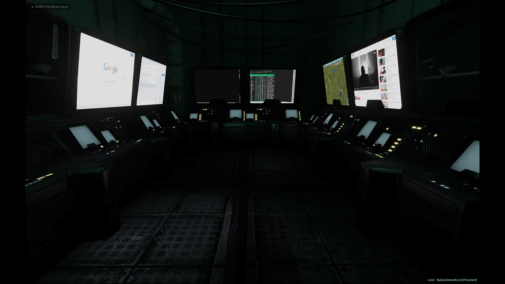

# gdd-project
# Development document
  
---
  
# Cyberpunk game

## Architecture

>> A CEF Browser connected to a webpage with an emulated terminal (connected through ssh to a VM)

### Using a CEF Browser in-game

**Some examples with RadiantUI SDK**:
  

